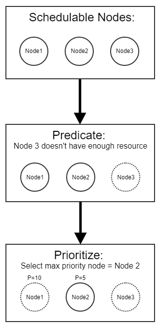

Powered by R Notebook

## Perior state-of-the-art implemenetation

The architecture of scheduler is simple, which has two strategies: spread and pack.

In the spread mode, the scheduler will select a new node to run the app. And spread mode is the default mode in treadmill.

In the pack mode, the scheduler will select the same node until the node has no capacity.

```{python, eval=FALSE, include=FALSE}
class SpreadStrategy(Strategy):
    """Spread strategy will suggest new node for each subsequent placement."""
    __slots__ = (
        'current_idx',
        'node',
    )

    def __init__(self, node):
        self.current_idx = 0
        self.node = node

    def suggested_node(self):
        """Suggest next node from the cycle."""
        for _ in range(0, len(self.node.children)):
            if self.current_idx == len(self.node.children):
                self.current_idx = 0

            current = self.node.children[self.current_idx]
            self.current_idx += 1
            if current:
                return current
        # Not a single non-none node.
        return None

    def next_node(self):
        """Suggest next node from the cycle."""
        return self.suggested_node()


class PackStrategy(Strategy):
    """Pack strategy will suggest same node until it is full."""
    __slots__ = (
        'current_idx',
        'node',
    )

    def __init__(self, node):
        self.current_idx = 0
        self.node = node

    def suggested_node(self):
        """Suggest same node as previous placement."""
        for _ in range(0, len(self.node.children)):
            if self.current_idx == len(self.node.children):
                self.current_idx = 0
            node = self.node.children[self.current_idx]
            if node:
                return node

        return None

    def next_node(self):
        """Suggest next node from the cycle."""
        self.current_idx += 1
        return self.suggested_node()
```

## Scheduler Architecture


+ **Predicates:**  Predicates includes all Predicate algorithms. All Predicate algorithms inherit from the base class PredicateConfig.
+ **Priorities:**  Priorities includes all Prioritize algorithms. All Prioritize algorithms inherit from the base class PredicateConfig.
+ **Provider:**  Provider offers scheduling algorithms. Provider uses ```register_priorities(name, weight)``` and ```register_predicates (name)``` functions to select algorithms from Predicates and Priorities respectively. Provider then uses the selected algorithm to Predicate and Prioritize the schedulable nodes. Finally, Provider selects the fittest node

## The scheduling algorithm



+ First, Provider gets a set of schedulable nodes.
+ Second, Provider applies "Predicate" to filter out inappropriate nodes.
+ Finally, Provider applies "Prioritize" that rank the nodes that weren't filtered out. The node with the highest priority is chosen.

## Evualuation

TL; DR: Most applications in Morgan Treadmill are long-running, so the overhead of the shceduler is not the bottleneck.


The figure illustrates the lifecycle of a task in a cluster manager: after the user submits the task, it waits until the scheduler places it on a machine where it subsequently runs.  The time between submission and task placement is the
task placement latency, and to the total time between the task’s submission and its completion is the task response time. The time a task spends being actively scheduled is the scheduler’s algorithm runtime.\cite{Firmament}

In Morgan, most applications in Morgan Treadmill are long-running. The performance of the scheduler is not the bottleneck. But to show the performance of the scheduler, we evaluate how well the scheduler meets its goals:

* Configurable scheduling algorithms
* Performance
* Task placement quality

To evaluate performance,we implement some benchmark tests, which could run the scheduler and schedule some virtual apps in virtual nodes. And we could get the response time and function calls graph.

Besides this, this research reuses the simulator in sparrow, which implements some state-of-the-art scheduling policies and simulate those policies in virtual environment. This research will introduce Morgan Stanley's trace data into the simulator and try to find which policy fits well. (To be determined)

As for the Task placement quality, we reuses the unit test cases of the prior scheduler. Now there is only one test cases failed and we think it is a logic bug in the prior scheduler.

To test the configurability, we manually creats multiple scheduler processes with different scheduling algorithms. These schedulers returns different results depending one the scheduling algorithms they use.

### Schedle apps in 500 nodes

There may be some errors during this evaluation, because the kernel switches the thread from core 8 to core 4 sometimes.

The time complexity is $$O(N_{app}^2)$$, but the benckmark counts the data preparation time into the total time, so the actual time coplexity should be $$O(N_{app})$$, and the accurate complexity should be $$O(N_{app} * \log N_{node})$$. In this evaulation, The number of nodes is a constant value, so it should be linear.

```{r Schedule apps in 500 nodes, echo=FALSE, message=FALSE, warning=FALSE}
library(plotly)

dt <- read.table("./500-node-from-500-to-1000-app/500-node-from-500-to-1000-app.txt",
                 col.names=c("number", "time"),
                 fill=FALSE,
                 strip.white=TRUE)

l1 = lm(data = dt, time ~ number)
l2 = lm(data = dt, time ~ I(number^2))

p <- plot_ly(data = dt, x = ~number, y = ~time, name = 'raw data', type = 'scatter') %>% 
  add_trace(y = predict(l2), mode = 'lines', name = 'X^2')

p
```

After edit:

```{r, echo=FALSE, message=FALSE, warning=FALSE}
library(plotly)

dt <- read.table("500-node-from-500-to-1000-app/500-node-from-500-to-1000-app-linear.txt",
                 col.names=c("number", "time"),
                 fill=FALSE,
                 strip.white=TRUE)

l1 = lm(data = dt, time ~ number)
l2 = lm(data = dt, time ~ I(number^2))

p <- plot_ly(data = dt, x = ~number, y = ~time, name = 'raw data', type = 'scatter') %>% 
  add_trace(y = predict(l1), mode = 'lines', name = 'linear')

p

```

### Schedule 500 apps from 500 to 1000 node

```{r, echo=FALSE, message=FALSE, warning=FALSE}
library(plotly)

dt <- read.table("500-app-from-500-to-1000-node/500-app-from-500-to-1000-node.txt",
                 col.names=c("number", "time"),
                 fill=FALSE,
                 strip.white=TRUE)

l1 = lm(data = dt, time ~ number)
l2 = lm(data = dt, time ~ I(number^2))

p <- plot_ly(data = dt, x = ~number, y = ~time, name = 'raw data', type = 'scatter') %>% 
  add_trace(y = predict(l1), mode = 'lines', name = 'linear')

p
```

```{r, echo=FALSE, message=FALSE, warning=FALSE}
library(plotly)

dt <- read.table("500-app-from-500-to-1000-node/500-app-from-500-to-1000-node.txt",
                 col.names=c("number", "time"),
                 fill=FALSE,
                 strip.white=TRUE)

dtTree <- read.table("500-app-from-500-to-1000-node-tree/500-app-from-500-to-1000-node-tree.txt",
                 col.names=c("number", "time"),
                 fill=FALSE,
                 strip.white=TRUE)

l1 = lm(data = dt, time ~ number)

p <- plot_ly(data = dt, x = ~number, y = ~time, name = 'Flat Architecture', type = 'scatter') %>%
  add_trace(y = predict(l1), mode = 'lines', name = 'Flat Architecture Regression') %>%
  add_trace(y = dtTree$time, type = 'scatter', name = 'Hierarchy Architecture')

p
```

